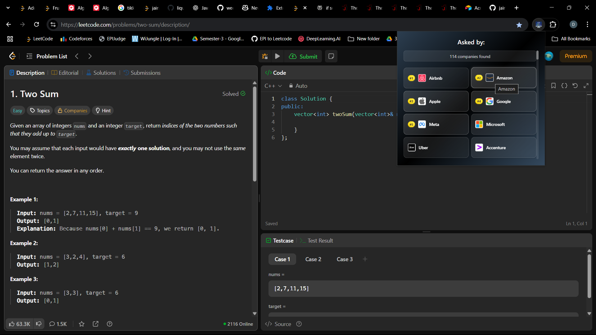

# LeetCode Company Finder

A Chrome extension that shows which companies have asked specific LeetCode problems in their interviews. Never wonder again which companies use that tricky algorithm question!



## Features

- **Instant Company Lookup**: Automatically detects the current LeetCode problem and shows companies that have asked it
- **Beautiful UI**: Clean, modern interface with company logos and organized layout
- **Real-time Data**: Fetches up-to-date company information from a curated database
- **Top Company Highlighting**: Highlights major tech companies (Google, Microsoft, Amazon, etc.)
- **Comprehensive Coverage**: Covers hundreds of companies including FAANG, startups, and financial institutions

## Installation

### Method 1: Load as Unpacked Extension (Recommended for Development)

1. **Download the Extension**
   - Clone this repository or download the ZIP file
   - Extract to a folder on your computer

2. **Enable Developer Mode in Chrome**
   - Open Chrome and go to `chrome://extensions/`
   - Toggle on **Developer mode** (top right corner)

3. **Load the Extension**
   - Click **"Load unpacked"**
   - Select the folder containing the extension files
   - The extension should now appear in your extensions list

4. **Pin the Extension** (Optional)
   - Click the puzzle piece icon in Chrome's toolbar
   - Find "LeetCode Company Finder" and click the pin icon

### Method 2: Chrome Web Store (Coming Soon)
*This extension will be available on the Chrome Web Store soon!*

## How to Use

### Step 1: Navigate to LeetCode
1. Go to [leetcode.com](https://leetcode.com)
2. Open any problem (e.g., `https://leetcode.com/problems/two-sum/`)

### Step 2: Open the Extension
1. Click the LeetCode Company Finder icon in your Chrome toolbar
2. Or use the keyboard shortcut (if configured)

### Step 3: View Company Information
- The extension will automatically detect the current problem
- A popup will show all companies that have asked this problem
- Companies are sorted with major tech companies prioritized first
- Top 5 companies get special rank badges (#1, #2, etc.)

## What You'll See

The extension popup displays:
- **Company Count**: Total number of companies found
- **Company List**: Grid layout with company names and logos
- **Rank Badges**: Special highlighting for top companies
- **Company Logos**: Automatically fetched company logos where available
- **Fallback Icons**: Clean letter-based icons for companies without logos

## Troubleshooting

### Extension Not Working?

1. **Reload the Extension**
   - Go to `chrome://extensions/`
   - Find "LeetCode Company Finder"
   - Click the reload button

2. **Check Permissions**
   - Ensure the extension has permission to access LeetCode
   - Refresh the LeetCode page after installing

3. **Clear Cache**
   - Hard refresh the LeetCode page (Ctrl+Shift+R)
   - Try opening the extension in an incognito window

### No Companies Showing?

1. **Check the Problem URL**
   - Make sure you're on a problem page (`/problems/problem-name`)
   - The extension only works on individual problem pages

2. **Network Issues**
   - Check your internet connection
   - The extension fetches data from an external API

3. **Problem Not in Database**
   - Some newer or less common problems might not be in the database yet
   - The database is regularly updated with new problems

## Supported Companies

The extension covers a wide range of companies including:

**Major Tech Companies:**
- Google, Microsoft, Amazon, Apple, Meta (Facebook)
- Netflix, Uber, Airbnb, Twitter, LinkedIn

**Financial Services:**
- Goldman Sachs, J.P. Morgan, Morgan Stanley
- Bloomberg, Capital One, PayPal

**Other Notable Companies:**
- Adobe, Oracle, Nvidia, Intel, Cisco
- Shopify, Stripe, Square, Zoom
- And hundreds more...

## Technical Details

### Architecture
- **Content Script**: Detects LeetCode problems and fetches company data
- **Popup Interface**: Displays company information in a clean UI
- **Background Service**: Handles extension lifecycle and storage
- **External API**: Fetches up-to-date company data

### Permissions Required
- `activeTab`: To detect the current LeetCode problem
- `storage`: To cache company data for better performance
- `host_permissions`: To fetch company logos and problem data

### Data Source
The extension uses a curated database that aggregates information from:
- LeetCode premium company filters
- Interview experiences shared online
- Company-specific coding challenges
- Regular updates from the community

## Contributing

We welcome contributions! Here's how you can help:

### Reporting Issues
1. Go to the Issues tab in this repository
2. Check if your issue already exists
3. Create a new issue with detailed information

### Suggesting Features
1. Open a feature request issue
2. Describe the feature and why it would be useful
3. Include mockups or examples if possible

### Code Contributions
1. Fork the repository
2. Create a feature branch (`git checkout -b feature/AmazingFeature`)
3. Make your changes
4. Test thoroughly
5. Commit your changes (`git commit -m 'Add AmazingFeature'`)
6. Push to the branch (`git push origin feature/AmazingFeature`)
7. Open a Pull Request

## Development Setup

### Prerequisites
- Chrome browser
- Basic knowledge of HTML, CSS, JavaScript
- Understanding of Chrome Extension APIs

### Local Development
1. Clone the repository
2. Make changes to the source files
3. Go to `chrome://extensions/`
4. Click reload on the extension
5. Test your changes on LeetCode

### File Structure
```
leetcode-company-extension/
├── manifest.json          # Extension configuration
├── content.js            # Detects problems and fetches data
├── popup.html           # Extension popup HTML
├── popup.js             # Popup logic and UI
├── background.js        # Background service worker
├── style.css            # Popup styling
├── programming.png      # Extension icon
└── README.md           # This file
```

## License

This project is licensed under the MIT License - see the [LICENSE](LICENSE) file for details.

## Acknowledgments

- Thanks to the LeetCode community for sharing interview experiences
- Company logo providers: Clearbit, Logo.dev
- All contributors who help maintain and improve this extension

## Support

If you encounter any issues or have questions:

1. **Check the FAQ** in this README
2. **Search existing issues** in the repository
3. **Create a new issue** if your problem isn't covered
4. **Star the repository** if you find it useful!

---

**Happy Coding!**
